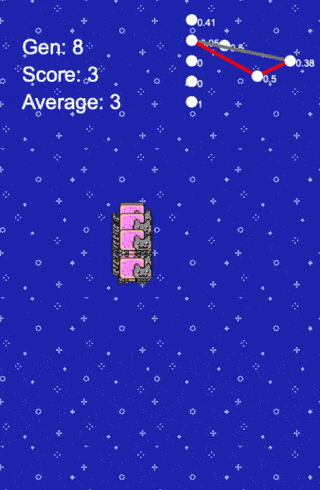

# Flappy Nyan Cat played by NEAT

This is a "nyan cat" themed "flappy bird" game played by an genetic algorithm, called [Neat](https://en.wikipedia.org/wiki/Neuroevolution_of_augmenting_topologies) (Neuro Evolution with Augmenting Topologies). I was inspired by an [amazing youtube video](https://www.youtube.com/watch?v=qv6UVOQ0F44) by Seth Bling where he used the algorithm to learn to play mario. 

My implementation is based on the [original NEAT paper](http://nn.cs.utexas.edu/downloads/papers/stanley.ec02.pdf). The algorithm works by generating an initial population and then assigning a fitness score based on the performance of the network. The best are selected to be bred for the next generation. The speciality of this algorithm is that the networks only compete to similar networks, so the population is split into species. It allows to keep some genetic differencies and different characteristics. In many ways the algorithm works very similarly to nature.

I tried to see what it can do on flappy bird. The network sees the distants to the next pipe pair, the vertical distance to the middle of the pipe gap and it's vertical speed. Overall it performs good because it's not a very complex game, but sometimes gets stuck in evolutionary pitfalls.

It was nice to see what evolution can do on a game like flappy bird.